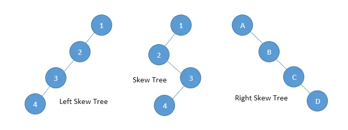
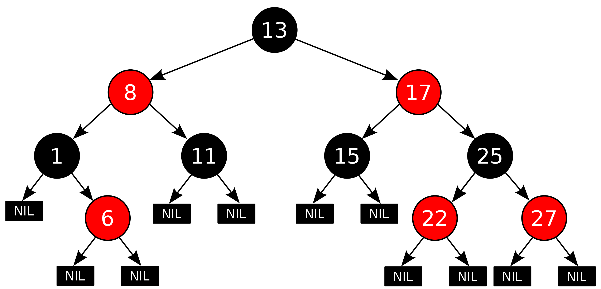

# Ch 3 - Some Familiar Data Structures in a Functional Setting

- [Ch 3 - Some Familiar Data Structures in a Functional Setting](#ch-3---some-familiar-data-structures-in-a-functional-setting)
  - [Reviewing Trees](#reviewing-trees)
  - [Red-Black Trees](#red-black-trees)

## Reviewing Trees

**Trees** can be preferred over linear sequences because operations only require traversing the **depth** of the tree, rather than visiting every element. However, **skewed trees** (where every node has at most one child) end up looking exactly like linear sequences, having a single path that contains all `n` elements (AKA `depth == n`).

<center>Figure 1: Skewed Trees</center>

**Balanced trees**, like balanced binary search trees, are trees ensuring `log(n)` **depth**. Often, they maintain this balance by performing rebalancing on all update operations.

## Red-Black Trees

<center>Figure 2: Perfectly Balanced Red-Black Tree</center>

A **red-black tree** is a self-balancing binary search tree with the following criteria:
1. Every node is <span style="color:red">_red_</span> or <span style="color:#696969">_black_</span>.
2. The root and leaves(`E`) are <span style="color:#696969">_black_</span>.
3. If a node is <span style="color:red">_red_</span>, then its children are <span style="color:#696969">_black_</span>.
4. All paths from a node to it's leaves (`E`) contain the same number of <span style="color:#696969">_black_</span> nodes.
5. The longest path is no more than twice the length of the shortest path.
   1. **Shortest Path**: all <span style="color:#696969">_black_</span> nodes
   2. **Longest Path**: alternating <span style="color:red">_red_</span> and <span style="color:#696969">_black_</span> nodes.
6. Form a set, so no duplicates.

```haskell
data Color = Red | Black
data RedBlackTree a =
    Empty
  | Tree Color (RedBlackTree a) a (RedBlackTree a)
instance Ord a => Set RedBlackTree a where
  ...
```

Red-black trees achieve balance (decrease the height of tree) through rotation, altering structure of tree by re-arranging its subtrees. 

Rotation - O(1):
* Ensure maximum height is `log(n)`
* Larger subtrees move up, smaller subtrees move down
* Does not change order of elements
